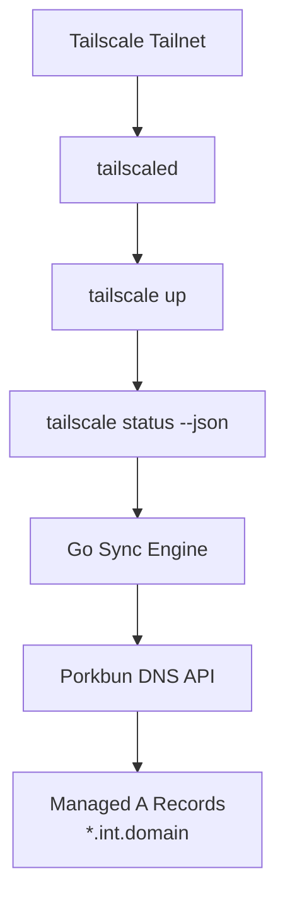

# TailScale Porkbun DNS Sync

> Automatic Porkbun DNS updates from live Tailscale peer state.

[](#development)
[](#deployment)
[](#what-it-does)
[](#deployment)
[](#changelog)

TailScale Porkbun DNS Sync is a Go service that joins your tailnet, reads `tailscale status --json`, and continuously reconciles Porkbun `A` records for a delegated subdomain like `*.int.ima.fish`.

The repository name is user-facing. The runtime binary remains `porkbun-dns`.

## Why This Exists

Tailscale gives every node a stable tailnet identity and IP, but external DNS providers do not update themselves from that state. This project closes that gap by turning live tailnet membership into DNS records you can actually use.

It is built for operators who want:

- machine names from Tailscale reflected in Porkbun
- one container that authenticates, syncs, and keeps running
- no manual record editing for tailnet nodes
- a simple scheduled reconciliation loop instead of brittle ad hoc scripts

## What It Does

For each Tailscale node with an IPv4 address, the service manages:

- `<machine>.int.<domain>` -> `<tailscale-ip>`

It only manages `A` records under the configured subdomain suffix. Everything else in Porkbun is left alone.

The sync prefers the label derived from Tailscale `DNSName`, so records follow MagicDNS-style names such as:

```text
workstation.int.ima.fish
dockerpi.int.ima.fish
beaglebase.int.ima.fish
```

## Architecture



## Sync Behavior

Each run performs the same reconciliation flow:

1. Start or reuse an authenticated `tailscaled` instance.
2. Fetch local tailnet state with `tailscale status --json`.
3. Extract node names and IPv4 Tailscale addresses.
4. Fetch existing Porkbun DNS records.
5. Create missing records.
6. Update changed records.
7. Delete stale records under the managed subdomain.
8. Sleep for `SYNC_INTERVAL` seconds and repeat.

If `SYNC_INTERVAL` is blank, the container performs one sync and exits.

## Project Layout

```text
cmd/porkbun-dns/          main program
internal/config/          env loading and validation
internal/tailscale/       tailscale status parsing
internal/porkbun/         Porkbun API client
internal/syncer/          reconciliation logic
docker/                   container startup scripts
compose.yaml              local deployment definition
```

## Quick Start

### 1. Create your local environment file

```sh
cp .env.example .env
```

Fill in:

- `PORKBUN_API_KEY`
- `PORKBUN_SECRET_API_KEY`
- `PORKBUN_DOMAIN`
- `TS_AUTHKEY`

### 2. Start the service

```sh
docker compose up -d --build
```

### 3. Watch it work

```sh
docker compose logs -f tailscale-porkbun-dns-sync
```

### 4. Check the live Tailscale view inside the container

```sh
docker exec tailscale-porkbun-dns-sync \
  tailscale --socket=/var/run/tailscale/tailscaled.sock status
```

## Configuration

### Required

| Variable | Purpose |
| --- | --- |
| `PORKBUN_API_KEY` | Porkbun API key |
| `PORKBUN_SECRET_API_KEY` | Porkbun secret API key |
| `PORKBUN_DOMAIN` | Root DNS zone, for example `ima.fish` |
| `TS_AUTHKEY` | Tailscale auth key for first-time enrollment |

### Common Optional

| Variable | Default | Purpose |
| --- | --- | --- |
| `PORKBUN_SUBDOMAIN_SUFFIX` | `int` | Managed subdomain suffix |
| `PORKBUN_TTL` | `600` | TTL for managed `A` records |
| `SYNC_INTERVAL` | `3600` | Sync loop interval in seconds |
| `TS_HOSTNAME` | `tailscale-porkbun-dns-sync` | Tailnet hostname for this container |
| `TS_TUN_MODE` | `userspace-networking` | Tailscale container networking mode |
| `TS_EXTRA_ARGS` | `--accept-dns=false` | Extra args passed to `tailscale up` |
| `DRY_RUN` | `false` | Compute changes without mutating Porkbun |

## Deployment

The included [compose.yaml](/home/chad/porkbun-dns/compose.yaml) is the intended operational path.

It does three jobs:

- starts `tailscaled`
- authenticates or reuses saved Tailscale state
- runs the Go sync process on an interval

Tailscale state is persisted in a named Docker volume, so the node does not need to re-authenticate every time the container restarts.

## Example Operations

### Restart after config changes

```sh
docker compose up -d
```

### Follow logs

```sh
docker compose logs -f tailscale-porkbun-dns-sync
```

### Inspect service status

```sh
docker compose ps
```

### Run one-shot mode

```sh
docker compose run --rm -e SYNC_INTERVAL= tailscale-porkbun-dns-sync
```

## Development

### Run tests

```sh
docker run --rm -v "$PWD:/src" -w /src golang:1.25 go test ./...
```

### Build the image

```sh
docker build -t porkbun-dns .
```

## Versioning

Current version: `1.0.0`

Version metadata lives in:

- [VERSION](/home/chad/porkbun-dns/VERSION)
- [CHANGELOG.md](/home/chad/porkbun-dns/CHANGELOG.md)

### Key implementation points

- the app uses `tailscale status --json`, not brittle text parsing
- only managed `A` records under the delegated subdomain are touched
- duplicate managed records are collapsed during reconciliation
- name selection prefers Tailscale `DNSName` over raw `HostName`

## Security

Do not commit live credentials, auth keys, or local state.

Keep these local only:

- `.env`
- `resources.md`
- exported Tailscale state
- private keys, certs, or ad hoc operator notes

Use [.env.example](/home/chad/porkbun-dns/.env.example) as the shareable template. If a secret is ever committed accidentally, rotate it immediately.

## Notes

This project intentionally uses Tailscale userspace networking inside the container. That keeps the runtime lightweight and avoids requiring a kernel TUN setup just to inspect tailnet membership and update DNS.

## Changelog

See [CHANGELOG.md](/home/chad/porkbun-dns/CHANGELOG.md).
